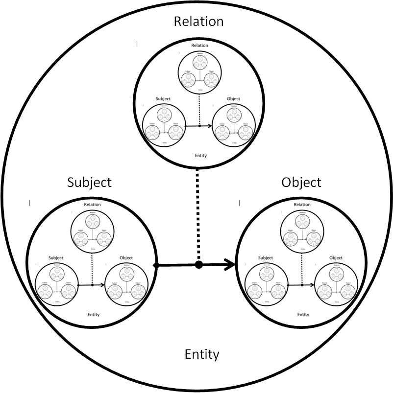

[jsonRVM Documentation](https://netkeep80.github.io/jsonRVM/)

# json Relations (Model) Virtual Machine
            R
         S__|__O
       O   _|_   S     Fractal
    R__|__/_|_\__|__R  Triune
       |  \_|_/  |     Entity
       S    |    O     
          __|__
         /  |  \
        /___|___\

## Used third-party tools

jsonRVM using the following third-party tools. Thanks a lot!

- [**JSON for Modern C++**](https://github.com/nlohmann/json) for load/exec/unload json view of Relations Model
- [**The fastest feature-rich C++ single-header testing framework**](https://github.com/onqtam/doctest) for unit testing of Relations (Model) Virtual Machine
- [**A C++11 single-file header-only cross platform HTTP/HTTPS library**](https://github.com/yhirose/cpp-httplib) for writing http base vocabulary for Relations (Model) Virtual Machine
- [**xml2json is a header-only C++ library**](https://github.com/Cheedoong/xml2json) for writing http base vocabulary for Relations (Model) Virtual Machine
