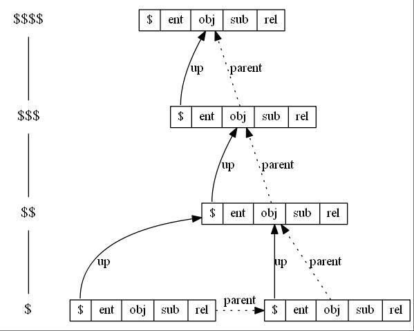

# Терминологический аппарат
(1.сделать гиперсылки)
(2.сделать картинки)
(3.сделать примеры)

## Ассоциативная Модель Данных
Модель данных используемая для хранения [**Модели Отношений**](#модель-отношений) в базе данных

## Внешняя структура сущности
Это [**Модель Отношений**](#модель-отношений) в которых [**сущность**](#сущность) учавствует в роли [**субъекта**](#субъект) [**объекта**](#объект) или [**отношения**](#отношение)

## Внутренняя структура сущности
Это [**экземпляр отношения**](#экземпляр-отношения)

## Дерево контекстов исполнения
Контексты исполнения РВМ образуют многоуровневую иерархию исполнения экземпляров сущностей посредством связей двух типов: [**связями порождения**](#связь-порождения) и контекстной связью .
, связи в которой образуются от родительских контекстов исполнения к дочерним и от нижележащих к вышестоящим.
РВМ может порождать дочерние контексты исполнения как на том же уровне, так и на нижележащем, а связь с вышестоящим контекстом есть независимо от родительского.

## Дочерний контекст исполнения
Это [**контекст исполнения**](#контекст-исполнения) порождённый РВМ в текущем контексте исполнения при исполнении [**сущности отношения**](#сущность-отношение).

!!!!!!!!!!!!!!!!!!!!!!!!!!!!!!!!!
## Исполнение сущности
Вычисление РВМ отношения результата исполнения сущности в роли отношения в контексте исполнения

## Контекст исполнения
Это среда для исполнения [**сущности отношения**](#сущность-отношение) в процессе работы РВМ.
Функцией контекста исполнения является предоставление доступа через [**местоимения**](#местоимение) к текущему исполняемому экземпляру сущности.
По своей структуре контекст исполнения является [**экземпляром сущности**](#экземпляр-сущности) в [**дереве контекстов исполнения**](#дерево-контекстов-исполнения).
Текущий контекст исполнения обозначается через \$

## Контекстная связь
Это связь нижележащего контекста исполнения с вышестоящим. Эта связь хранится в структуре данных контекста исполнения и используется программистом для доступа к вышестоящим уровням контекста исполнения через [**местоимения**](#местоимение).

## Контекстная сущность
[**Местоимение**](#местоимение) для ссылки на [**сущность**](#сущность), экземпляром, которой является текущий [**контекст исполнения**](#контекст-исполнения) РВМ
Обозначается через \$ent

## Корневой контекст исполнения
Контекст исполнения для которого родительским является он сам

## Корень модели отношений
## Корневая сущности модели отношений
Сущность - экземпляр отношения, в котором эта же сущность выступает в роли субъекта, отношения и объекта.

## Местоимение
Имя - ссылка, которая указывает на разные уровни [**контекста исполнения**](#контекст-исполнения)
или [**элементы контекста исполнения**](#элемент-контекста-исполнения) РВМ

## Модель Отношений
Множество [**сущностей**](#сущность) связанное [**отношениями**](#отношение).
[**Модель Отношений**](#модель-отношений) определяет [**внутреннюю**](#внутренняя-структура-сущности) и [**внешнюю**](#внешняя-структура-сущности) [**структуру сущности**](#структура-сущности).

## Связь порождения
Это связь дочернего контекста исполнения с его родителем. Эта связь автоматически образуется стэком вызовов РВМ и используется для своей работы.

## Структура сущности
Это [**Модель Отношений**](#модель-отношений) сущности

## Сущность
В зависимости от контекста употребления:
1. В МО - [**Экземпляр отношения**](#экземпляр-отношения) между [**субъектом**] и [**объектом**]
2. В РВМ - [**Контекстная сущность**]

## Текущий контекст исполнения
Это [**контекст исполнения**](#контекст-исполнения) в котором в данный момент РВМ [**исполняет сущность**](#исполнение-сущности).

## Триплет
Кортеж длины 3, также носит название «упорядоченная тройка»

## Уровни контекста исполнения
Уровни определяют вложенность контекстов исполнения.
Бывают: вышестоящий, текущий, нижележащий
Вышестоящие контексты исполнения обозначается через уровни \$, \$\$
и т.д. до \$\$\$\$

## Экземпляр сущности
[**Сущность**](#сущность) инстанцированная в [**контекст исполнения**](#контекст-исполнения) РВМ
По сути тоже самое что и [**контекст исполнения**](#контекст-исполнения)
(не путать с [**экземпляром отношения**](#экземпляр-отношения))

"+" = +
"(1 + 1)" = (sub = 1, rel = +, obj = 1)
ctx = ( ent = (sub = 1, rel = +, obj = 1), obj = 1, sub = 1, rel = 2)

## Элемент контекста исполнения
Члены структуры данных [**контекста исполнения**](#контекст-исполнения)
1. **контекстная сущность**
2. **контекстный субъект**
3. **контекстное отношение**
4. **контекстный объект**

------------------ дальше не по алфавиту -------------------------

## Экземпляр отношения
Уникально идентифицируемый триплет: субъект, отношение, объект

## Значение сущности
Результат вычисления отношения, экземпляром которого является сущность

## Исполнение модели отношений
Процесс вычисления значения сущности - экземпляра отношения

## Сущность субъект
Сущность выступающая в экземпляре отношения в роли субъекта

## Контекстный субъект
Местоимение для ссылки на субъект контекста исполнения РВМ
Обозначается через \$sub

## Субъект
В зависимости от контекста употребления:
1. В МО - Сущность субъект
2. В РВМ - Контекстный субъект

## Сущность отношение
Сущность выступающая в экземпляре отношения в роли отношения

## Контекстное отношение
Местоимение для ссылки на отношение контекста исполнения РВМ
т.е. на текущее значение инстанцированной сущности
Обозначается через \$rel

## Отношение
В зависимости от контекста употребления:
1. В МО - Сущность отношение
2. В РВМ - Контекстное отношение

## Сущность объект
Сущность выступающая в экземпляре отношения в роли объекта

## Контекстный объект
Местоимение для ссылки на объект контекста исполнения
Обозначается через \$obj

## Объект
В зависимости от контекста употребления:
1. В МО - Сущность объект
2. В РВМ - Контекстный объект

## Инстанцирование сущности - Инстанциование экземпляра отношения
Создание нового экземпляра контекста исполнения для исполнения сущности

## Проекция сущности
Результат исполнения сущности в роли отношения в контексте исполнения

## Вычисление отношения
Получение значение контестного отношения после исполнение
сущности отношения в контексте исполнения

## Значение сущности - Значение экземпляра отношения
Вычисленное значение контестного отношения

 
## Лямбда cтруктура
Множество пар "имя поля": значение поля, где:
* значение поля - иерархический путь к json значению, которое необходимо исполнить RVM в текущем контексте
* имя поля - иерархический путь к json значению которое необходимо вычислить

Вычисление проекций множества пар должно происходить параллельно, в многопоточном режиме

## Лямбда вектор
Массив json значений, которое необходимо исполнить RVM в текущем контексте, при этом последовательно используется текущее значение инстанцированной сущности