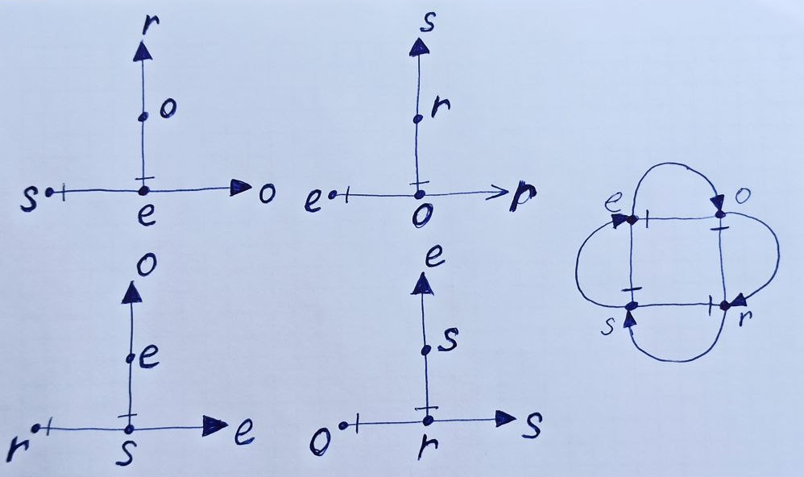

# Математическая модель

## МО в теории множеств

 МО в теории множеств представляется как множество 4х взаимосвязанных множеств
ссылок на кортежи длины 3, компонентами кортежей являются ссылки на кортежи.
В качестве ссылок используются индексы кортежей.

RM = {E, O, R, S}, где

R ⊆ O×S×E = {(o,s,e): o ∈ S, s ∈ O, e ∈ E} - множество кортежей отношений

O ⊆ E×R×S = {(e,r,s): e ∈ E, r ∈ R, s ∈ S} - множество кортежей объектов

S ⊆ R×E×O = {(r,e,o): r ∈ R, e ∈ E, o ∈ O} - множество кортежей субъектов

E ⊆ S×O×R = {(s,o,r): s ∈ O, o ∈ S, r ∈ R} - множество кортежей сущностей

```cpp
struct R {
    O* o;
    S* s;
    E* e;
};

struct O {
    E* e;
    R* r;
    S* s;
};

struct S {
    R* r;
    E* e;
    O* o;
};

struct E {
    S* s;
    O* o;
    R* r;
};
```

## Преобразование 4х множеств кортежей длины 3 к 4м множествам кортежей длины 2:

1. группировка компонент триплетов в связи
   
R -> OS×E = OS×(SO×R) = OS×(SO×(OS×E))

O -> ER×S = ER×(RE×O) = ER×(REx(ER×S))

S -> RE×O = RE×(ER×S) = RE×(ER×(RE×O))

E -> SO×R = SO×(OS×E) = SO×(OS×(SO×R))

2. Докажем что типы связей представляющие триплеты R,O,S,E
 эквивалентны типам связей OS, ER, RE, SO соответственно, т.е.:

R x E -> Rx(SO×R)

O x S -> Ox(RE×O)

S x O -> Sx(ER×S)

E x R -> Ex(OS×E)


--------------------------------------

2. Справедливо следующее:

R -> OS×E = OS×(SO×R) = OS×(SO×(OS×E)) = OS×(SO×...) = OSx...

O -> ER×S = ER×(RE×O) = ER×(REx(ER×S)) = ER×(RE×...) = ERx...

S -> RE×O = RE×(ER×S) = RE×(ER×(RE×O)) = RE×(ER×...) = REx...

E -> SO×R = SO×(OS×E) = SO×(OS×(SO×R)) = SO×(OS×...) = SOx...

3. Но если связать 2 с триплетами 1:

R x E -> (OS×...) x (SOx...) = (((ER×...) x (REx...))×...) x (SOx...)

O x S -> (ER×...) x (REx...) = (((SO×...) x (SOx...))×...) x (REx...)

S x O -> (RE×...) x (ERx...) = (((OS×...) x (SOx...))×...) x (ERx...)

E x R -> (SO×...) x (OSx...) = (((RE×...) x (ERx...))×...) x (SOx...)

4. Подставляем результаты 2 и 3 в 1:

R -> OS×E = ((ERx...) x (REx...)) x (SO×...)

O -> ER×S = ((SOx...) x (SOx...)) x (RE×...)

S -> RE×O = ((OSx...) x (SOx...)) x (ER×...)

E -> SO×R = ((REx...) x (ERx...)) x (OS×...)

5. Но если сравнить 2 и 4 то получим следующее:
   
R -> OS×E = OS×(SO...) = OS × ((RE... x ER...) x (SO...))

O -> ER×S = ER×(RE...) = ER × ((OS... x SO...) x (ER...))

S -> RE×O = RE×(ER...) = RE × ((SO... x SO...) x (RE...))

E -> SO×R = SO×(OS...) = SO × ((ER... x RE...) x (SO...))

Получаем всего 8 типов связей:
```cpp
struct OS {
    O* o;   S* s;
};

struct ER {
    E* e;   R* r;
};

struct RE {
    R* r;    E* e;
};

struct SO {
    S* s;    O* o;
};

struct R {
    OS* os;  E* e;
};

struct O {
    ER* er;  S* s;
};

struct S {
    RE* re;  O* o;
};

struct E {
    SO* so;  R* r;
};
```

1. Сокращение 8 типов связей до 4х

Докажем правомочность сокращения 8 типов связей до 4, через подмену типов:
R -> OS - удаление типа связи R, и использование вместо него типа связи OS
O -> ER - удаление типа связи O, и использование вместо него типа связи ER
S -> RE - удаление типа связи S, и использование вместо него типа связи RE
E -> SO - удаление типа связи E, и использование вместо него типа связи SO

Для этого во первых надо доказать, что в связях вместо типов триплетов R, O, S, E
можно использовать типы связей RE, OS, SO, ER cоответственно.


```cpp
struct OS {
    O* o;   S* s;
};

struct ER {
    E* e;   R* r;
};

struct RE {
    R* r;   E* e;
};

struct SO {
    S* s;   O* o;
};

struct R {
    OS* os; E* e;
};

struct O {
    ER* er; S* s;
};

struct S {
    RE* re; O* o;
};

struct E {
    SO* so; R* r;
};
```

Во вторых доказать что 

R -> ((O×S)×E) = (OS×E) = (RxE) 
O -> ((E×R)×S) = (ER×S) = (O×S)
S -> ((R×E)×O) = (RE×O) = (SxO)
E -> ((S×O)×R) = (SO×R) = (E×R)

OS ⊆ O×S = {(o,s): o ∈ O, s ∈ S}
SO ⊆ S×O = {(s,o): s ∈ S, o ∈ O}
RE ⊆ R×E = {(r,e): r ∈ R, e ∈ E}
ER ⊆ E×R = {(e,r): e ∈ E, r ∈ R}

E = SO ⊆ (SO×OS)
O = ER ⊆ (ER×RE)
R = OS ⊆ (OS×SO)
S = RE ⊆ (RE×ER)



Cтрелка A -> B, может быть прочитана как "A сопряженный с B"

Так же из этого следует, что множества E, O, R, S эквивалентны. Это ещё раз подтверждает, что в МО сущность можно использовать в качестве субъекта, отношения или объекта.

## Множество кортежей - сущностей Модели Отношений

Кортеж сущность эквивалентен кортежу субъект-объекта:

e = (s,o,r) = ((s,o),r) = (so,r) = so = (so, re)

## Множество кортежей - объектов Модели Отношений

Кортеж объект эквивалентен кортежу сущность-отношения:

o = (e,r,s) = ((e,r),s) = (er,s) = er = (er, so)

## Множество кортежей - отношений Модели Отношений

Кортеж отношение эквивалентен кортежу объект-субъекта:

r = (o,s,e) = ((o,s),e) = (os,e) = os = (os, er)

## Множество кортежей - субъектов Модели Отношений

Кортеж субъект эквивалентен кортежу отношение-сущности:

s = (r,e,o) = ((r,e),o) = (re,o) = re = (re, os)

## МО в теории множеств как множество взаимосвязанных множеств кортежей длины 2

Множество RM может быть эквивалентно представлено 4мя множествами кортежей длины 2:

RM = {ER, OS, RE, SO}, где

E = SO ⊆ SO×OS = {(so, os): so ∈ SO, os ∈ OS} - множество кортежей субъект-объект

O = ER ⊆ ER×RE = {(er, re): er ∈ ER, re ∈ RE} - множество кортежей сущность-отношение

R = OS ⊆ OS×SO = {(os, so): os ∈ OS, so ∈ SO} - множество кортежей объект-субъект

S = RE ⊆ RE×ER = {(re, er): re ∈ RE, er ∈ ER} - множество кортежей отношение-сущность


Свойство сохранения относительного типа ассоциации.
Что это за свойства сохранения относительного типа ассоциации?

Занимательная аналогия с молекулярной биологией:

аденин (A) соединяется только с тимином (T) - двойная связь
гуанин (G) — только с цитозином (C) - тройная связь
