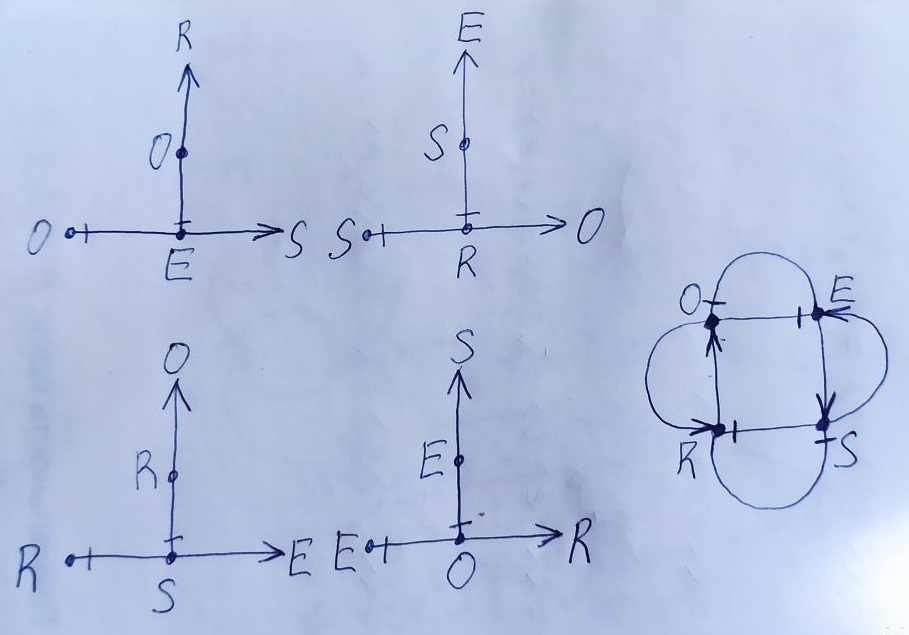

# Математическая модель

## МО в теории множеств как множество взаимосвязанных множеств кортежей длины 3

    RM = {E,R,S,O}, где
        E - множество триединых сущностей
        R - множество триединых отношений
        S - множество триединых субъектов
        O - множество триединых объектов

## Множество кортежей - сущностей Модели Отношений

    E = O×S×R = {(o,s,r): o ∈ O, s ∈ S, r ∈ R}

Кортеж сущность эквивалентен кортежу сущность-отношения:

    e = (o,s,e) <=> ((o,s),r) = (os,r) <=> (e,r) <=> o

Множество кортежей объект->субъекта эквивалентно множеству кортежей сущностей:

    OS = O×S = {(o,s): o ∈ O, s ∈ S} <=> E <=> ER

## Множество кортежей - отношений Модели Отношений

    R = S×O×E = {(s,o,e): s ∈ S, o ∈ O, e ∈ E}

Кортеж отношение эквивалентен кортежу отношение-сущности:

    r = (s,o,e) <=> ((s,o),e) = (so,e) <=> (r,e) <=> s

Множество кортежей субъект->объекта эквивалентно множеству кортежей отношений:

    SO = S×O = {(s,o): s ∈ S, o ∈ O} <=> R <=> RE

## Множество кортежей - субъектов Модели Отношений

    S = R×E×O = {(r,e,o): r ∈ R, e ∈ E, o ∈ O}

Кортеж субъект эквивалентен кортежу субъект-объекта:

    s = (r,e,o) <=> ((r,e),o) = (re,o) <=> (s,o) <=> r

Множество кортежей отношение->сущности эквивалентно множеству кортежей субъектов:

    RE = R×E = {(r,e): r ∈ R, e ∈ E} <=> S <=> SO

## Множество кортежей - объектов Модели Отношений
    
    O = E×R×S = {(e,r,s): e ∈ E, r ∈ R, s ∈ S}

Кортеж объект эквивалентен кортежу объект-субъекта:

    o = (e,r,s) <=> ((e,r),s) = (er,s) <=> (o,s) <=> e

Множество кортежей сущность->отношения эквивалентно множеству кортежей объектов:

    ER = E×R = {(e,r): e ∈ E, r ∈ R} <=> O <=> OS

## МО в теории множеств как множество взаимосвязанных множеств кортежей длины 2

Множества E, R, S, O могут быть эквивалентно представлены 4 множествами кортежей длины 2:

    E <=> OS - множество сущностей эквивалентно множеству объектов-субъективации,
    R <=> SO - множество отношений эквивалентно множеству субъективаций-объектов,
    S <=> RE - множество субъектов эквивалентно множеству отношений-сущностей,
    O <=> ER - множество объектов  эквивалентно множеству сущностей-отношений,

