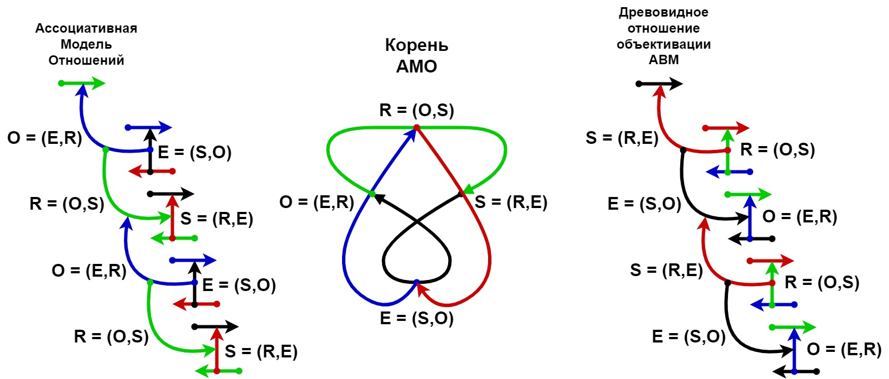

# Математическая модель

## МО в теории множеств представляется как множество 4х взаимосвязанных множеств кортежей длины 3

RM = {E, O, R, S}, где

R ⊆ O×S×E = {(o,s,e): o ∈ S, s ∈ O, e ∈ E} - множество кортежей отношений

O ⊆ E×R×S = {(e,r,s): e ∈ E, r ∈ R, s ∈ S} - множество кортежей объектов

S ⊆ R×E×O = {(r,e,o): r ∈ R, e ∈ E, o ∈ O} - множество кортежей субъектов

E ⊆ S×O×R = {(s,o,r): s ∈ O, o ∈ S, r ∈ R} - множество кортежей сущностей

## Преобразование множеств кортежей длины 3 к множествам кортежей длины 2:

E ⊆ (S×O×R) = ((S×O)×R) = (SO×R) = (SO×(OS×E)) = (SO×(OS×E))

SO = S×O = {(s,o): s ∈ S, o ∈ O}

O ⊆ (E×R×S) = ((E×R)×S) = (ER×S) = (ER×(RE×O)) = (ER×(RE×O))

ER = E×R = {(e,r): e ∈ E, r ∈ R}

R ⊆ (O×S×E) = ((O×S)×E) = (OS×E) = (OS×(SO×R)) = (OS×(SO×R))

OS = O×S = {(o,s): o ∈ O, s ∈ S}

S ⊆ (R×E×O) = ((R×E)×O) = (RE×O) = (RE×(ER×S)) = (RE×(ER×S))

RE = R×E = {(r,e): r ∈ R, e ∈ E}

=>

E × R = ER ⊆ (SO×(OS×(E × R)))

O × S = OS ⊆ (ER×(RE×(O × S)))

R × E = RE ⊆ (OS×(SO×(R × E)))

S × O = SO ⊆ (RE×(ER×(S × O)))

=>

E × R ⊆ (SO × (OS×ER)) => E ⊆ SO, R ⊆ OS × ER

O × S ⊆ (ER × (RE×OS)) => O ⊆ ER, S ⊆ RE × OS

R × E ⊆ (OS × (SO×RE)) => R ⊆ OS, E ⊆ SO × RE

S × O ⊆ (RE × (ER×SO)) => S ⊆ RE, O ⊆ ER × SO

=>

E ⊆ SO ⊆ (SO × RE) ⊆ (SO × RE × OS × ER × (SO))

O ⊆ ER ⊆ (ER × SO) ⊆ (ER × SO × RE × OS × (ER))

R ⊆ OS ⊆ (OS × ER) ⊆ (OS × ER × SO × RE × (OS))

S ⊆ RE ⊆ (RE × OS) ⊆ (RE × OS × ER × SO × (RE))

Cтрелка A -> B, может быть прочитана как "A сопряженный с B"

Так же из этого следует, что множества E, O, R, S эквивалентны. Это ещё раз подтверждает, что в МО сущность можно использовать в качестве субъекта, отношения или объекта.

## Множество кортежей - сущностей Модели Отношений

Кортеж сущность эквивалентен кортежу субъект-объекта:

e = (s,o,r) = ((s,o),r) = (so,r) = so = (so, re)

## Множество кортежей - объектов Модели Отношений

Кортеж объект эквивалентен кортежу сущность-отношения:

o = (e,r,s) = ((e,r),s) = (er,s) = er = (er, so)

## Множество кортежей - отношений Модели Отношений

Кортеж отношение эквивалентен кортежу объект-субъекта:

r = (o,s,e) = ((o,s),e) = (os,e) = os = (os, er)

## Множество кортежей - субъектов Модели Отношений

Кортеж субъект эквивалентен кортежу отношение-сущности:

s = (r,e,o) = ((r,e),o) = (re,o) = re = (re, os)

## МО в теории множеств как множество взаимосвязанных множеств кортежей длины 2

Множество RM может быть эквивалентно представлено 4мя множествами кортежей длины 2:

RM = {ER, OS, RE, SO}, где

ER ⊆ ER×SO = {(er, so): er ∈ ER, so ∈ SO} - множество кортежей сущностей-отношения

OS ⊆ OS×ER = {(os, er): os ∈ OS, er ∈ ER} - множество кортежей объектов-субъекта

RE ⊆ RE×OS = {(re, os): re ∈ RE, os ∈ OS} - множество кортежей отношений-сущности

SO ⊆ SO×RE = {(so, re): so ∈ SO, re ∈ RE} - множество кортежей субъектов-объекта
